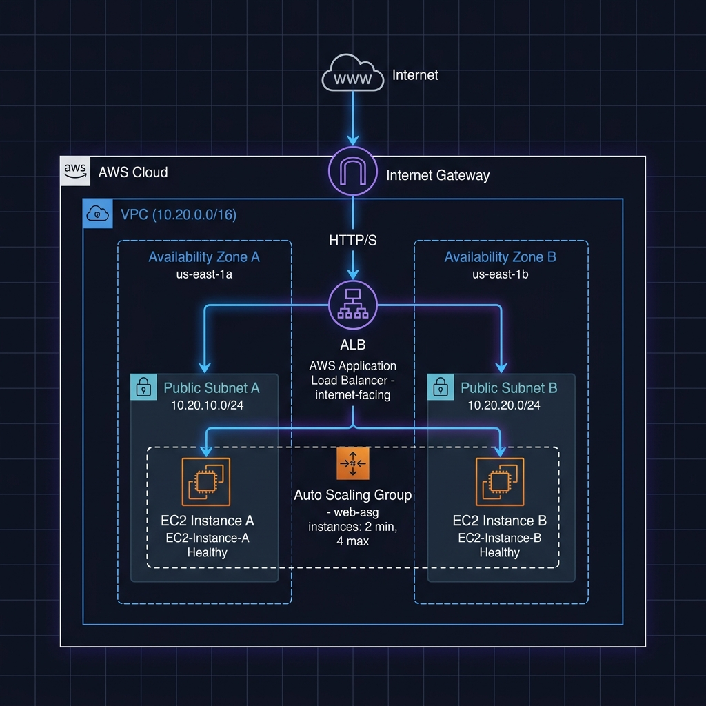

# Assignment: Highly Available Load-Balanced Web App with Auto Scaling

## Objective
Design and implement a highly available, fault-tolerant web application infrastructure on AWS using Terraform. This setup features a custom Virtual Private Cloud (VPC), two public subnets spanning separate Availability Zones, an Application Load Balancer (ALB), and an Auto Scaling Group (ASG) serving a modern dynamic web page that showcases real-time server metadata using EC2 Instance Metadata Service (IMDSv2).

---

## Architectural Diagram

The diagram below represents the target architecture you will provision using Terraform:



---

## Assignment Specifications

You must implement all infrastructure elements using **raw Terraform resources**. **Do not use any third-party Terraform modules** (such as the official AWS VPC module). All resources must be declared explicitly in your configurations.

### Part 1: S3 Backend Configuration
1. Configure your backend to store state files remotely in the S3 bucket created previously.
2. Use the DynamoDB table for state locking to prevent concurrent executions.
3. Configure this in `providers.tf` or `backend.tf` using the key path `assignment/alb-asg/terraform.tfstate`.

---

### Part 2: Custom Network Topology (No Modules)
Provision a virtual network from scratch:
1. **VPC**: Create a VPC with the CIDR block `10.20.0.0/16` (or defined via a variable).
2. **Subnets**: Create exactly **two Public Subnets** inside different Availability Zones (e.g., `us-east-1a` and `us-east-1b`) to ensure high availability. Enable `map_public_ip_on_launch = true`.
3. **Internet Gateway (IGW)**: Create and attach an IGW to your VPC.
4. **Route Table**: Create a public route table.
5. **Route**: Define a route directing all outbound traffic (`0.0.0.0/0`) to the Internet Gateway.
6. **Associations**: Associate both public subnets with your public route table.

---

### Part 3: Security Groups
Implement a secure traffic flow strategy:
1. **Load Balancer Security Group**:
   - Allow inbound HTTP traffic (port `80`) from anywhere (`0.0.0.0/0`).
   - Allow all outbound traffic.
2. **EC2 Instances Security Group**:
   - Allow inbound HTTP traffic (port `80`) **only** from the Application Load Balancer's Security Group.
   - Allow all outbound traffic.

---

### Part 4: Application Load Balancer (ALB)
Set up the entry point for your web application:
1. **ALB**: Provision an internet-facing Application Load Balancer distributed across your two public subnets.
2. **Target Group**:
   - Create an HTTP target group on port `80` with target type `instance`.
   - Configure basic health checks: path `/index.html`, healthy threshold `3`, unhealthy threshold `3`, timeout `5`, interval `30`.
3. **Listener**: Create an ALB Listener on port `80` that forwards all incoming traffic to your Target Group.

---

### Part 5: Launch Template & Auto Scaling Group (ASG)
Configure dynamic scaling for the application:
1. **Launch Template**:
   - Select the latest **Amazon Linux 2** or **Amazon Linux 2023** AMI.
   - Select instance type `t2.micro` or `t3.micro`.
   - Assign the EC2 Security Group created in Part 3.
   - Configure the standard Launch Template to require **IMDSv2** for metadata access (set `http_tokens = "required"` under `metadata_options`).
   - Provide a dynamic `user_data` script (see Part 6 below) that installs the web server and deploys the web application page.
2. **Auto Scaling Group**:
   - Deploy instances across both public subnets.
   - Associate the ASG with the Launch Template.
   - Connect the ASG to the ALB Target Group.
   - Set capacity parameters: `desired_capacity = 2`, `min_size = 2`, `max_size = 4`.

---

### Part 6: Bootstrapping App Content (`index.html` & `user_data.sh`)

To implement this dynamic web application, you will create two local files in the same directory as your Terraform configurations: `index.html` and `user_data.sh`.

#### File Structure
Organize your project directory as follows:
```text
terraform-alb-asg-assignment/
├── providers.tf
├── backend.tf
├── variables.tf
├── main.tf
├── outputs.tf
├── index.html        # Create this file and paste the HTML Template below
└── user_data.sh      # Create this file and paste the User Data Script below
```

#### 1. HTML Template (`index.html`)
Create a file named `index.html` in your project directory and paste the following pre-styled template:

```html
<!DOCTYPE html>
<html lang="en">
<head>
    <meta charset="UTF-8">
    <meta name="viewport" content="width=device-width, initial-scale=1.0">
    <title>Highly Available App - Terraform Assignment</title>
    <link rel="preconnect" href="https://fonts.googleapis.com">
    <link rel="preconnect" href="https://fonts.gstatic.com" crossorigin>
    <link href="https://fonts.googleapis.com/css2?family=Plus+Jakarta+Sans:wght@300;400;500;600;700&display=swap" rel="stylesheet">
    <style>
        :root {
            --bg-gradient-start: #0f172a;
            --bg-gradient-end: #020617;
            --primary: #6366f1;
            --primary-glow: rgba(99, 102, 241, 0.15);
            --success: #10b981;
            --success-glow: rgba(16, 185, 129, 0.15);
            --text-main: #f8fafc;
            --text-muted: #94a3b8;
            --card-bg: rgba(30, 41, 59, 0.7);
            --card-border: rgba(255, 255, 255, 0.08);
        }

        * {
            box-sizing: border-box;
            margin: 0;
            padding: 0;
        }

        body {
            font-family: 'Plus Jakarta Sans', sans-serif;
            background: linear-gradient(135deg, var(--bg-gradient-start), var(--bg-gradient-end));
            color: var(--text-main);
            min-height: 100vh;
            display: flex;
            align-items: center;
            justify-content: center;
            padding: 2rem;
            overflow-x: hidden;
            position: relative;
        }

        /* Ambient glow effects */
        body::before, body::after {
            content: '';
            position: absolute;
            width: 300px;
            height: 300px;
            border-radius: 50%;
            filter: blur(120px);
            z-index: 0;
            pointer-events: none;
        }

        body::before {
            background: rgba(99, 102, 241, 0.25);
            top: 15%;
            left: 20%;
        }

        body::after {
            background: rgba(16, 185, 129, 0.2);
            bottom: 15%;
            right: 20%;
        }

        .container {
            width: 100%;
            max-width: 650px;
            z-index: 1;
        }

        .card {
            background: var(--card-bg);
            backdrop-filter: blur(16px);
            -webkit-backdrop-filter: blur(16px);
            border: 1px solid var(--card-border);
            border-radius: 24px;
            padding: 3rem 2.5rem;
            box-shadow: 0 20px 40px -15px rgba(0, 0, 0, 0.5);
            text-align: center;
            position: relative;
            overflow: hidden;
        }

        .card::before {
            content: '';
            position: absolute;
            top: 0;
            left: 0;
            right: 0;
            height: 4px;
            background: linear-gradient(90deg, var(--primary), var(--success));
        }

        .badge-container {
            display: flex;
            justify-content: center;
            margin-bottom: 1.5rem;
        }

        .badge {
            background: rgba(99, 102, 241, 0.12);
            border: 1px solid rgba(99, 102, 241, 0.3);
            color: #a5b4fc;
            padding: 0.5rem 1rem;
            border-radius: 9999px;
            font-size: 0.85rem;
            font-weight: 600;
            letter-spacing: 0.05em;
            text-transform: uppercase;
            display: inline-flex;
            align-items: center;
            gap: 0.5rem;
        }

        .badge-dot {
            width: 8px;
            height: 8px;
            background-color: var(--primary);
            border-radius: 50%;
            display: inline-block;
            box-shadow: 0 0 8px var(--primary);
            animation: pulse 2s infinite;
        }

        h1 {
            font-size: 2.25rem;
            font-weight: 700;
            line-height: 1.25;
            margin-bottom: 0.75rem;
            background: linear-gradient(135deg, #ffffff 0%, #cbd5e1 100%);
            -webkit-background-clip: text;
            -webkit-text-fill-color: transparent;
        }

        .subtitle {
            color: var(--text-muted);
            font-size: 1.1rem;
            font-weight: 400;
            margin-bottom: 2.5rem;
        }

        .metadata-grid {
            display: grid;
            grid-template-columns: 1fr;
            gap: 1.25rem;
            margin-bottom: 2.5rem;
            text-align: left;
        }

        @media (min-width: 480px) {
            .metadata-grid {
                grid-template-columns: repeat(3, 1fr);
            }
        }

        .metadata-item {
            background: rgba(15, 23, 42, 0.6);
            border: 1px solid rgba(255, 255, 255, 0.04);
            border-radius: 16px;
            padding: 1.25rem;
            transition: all 0.3s ease;
            display: flex;
            flex-direction: column;
            gap: 0.5rem;
        }

        .metadata-item:hover {
            transform: translateY(-2px);
            border-color: rgba(99, 102, 241, 0.2);
            background: rgba(15, 23, 42, 0.8);
        }

        .meta-label {
            font-size: 0.75rem;
            font-weight: 600;
            text-transform: uppercase;
            letter-spacing: 0.05em;
            color: var(--text-muted);
        }

        .meta-value {
            font-family: monospace;
            font-size: 0.95rem;
            color: var(--text-main);
            word-break: break-all;
            font-weight: 500;
        }

        .status-banner {
            display: flex;
            align-items: center;
            justify-content: center;
            gap: 0.75rem;
            background: rgba(16, 185, 129, 0.08);
            border: 1px solid rgba(16, 185, 129, 0.2);
            padding: 1rem;
            border-radius: 16px;
            margin-bottom: 2rem;
        }

        .status-dot {
            width: 10px;
            height: 10px;
            background-color: var(--success);
            border-radius: 50%;
            box-shadow: 0 0 10px var(--success);
            animation: pulse 1.5s infinite;
        }

        .status-text {
            font-size: 0.95rem;
            font-weight: 600;
            color: #a7f3d0;
        }

        .footer {
            border-top: 1px solid rgba(255, 255, 255, 0.06);
            padding-top: 1.5rem;
            display: flex;
            flex-direction: column;
            align-items: center;
            gap: 0.5rem;
        }

        .footer-logo {
            font-size: 0.85rem;
            font-weight: 700;
            letter-spacing: 0.1em;
            text-transform: uppercase;
            background: linear-gradient(90deg, var(--primary), var(--success));
            -webkit-background-clip: text;
            -webkit-text-fill-color: transparent;
        }

        .footer-text {
            color: var(--text-muted);
            font-size: 0.8rem;
        }

        @keyframes pulse {
            0% {
                transform: scale(0.95);
                box-shadow: 0 0 0 0 rgba(16, 185, 129, 0.4);
            }
            70% {
                transform: scale(1);
                box-shadow: 0 0 0 8px rgba(16, 185, 129, 0);
            }
            100% {
                transform: scale(0.95);
                box-shadow: 0 0 0 0 rgba(16, 185, 129, 0);
            }
        }
    </style>
</head>
<body>
    <div class="container">
        <div class="card">
            <div class="badge-container">
                <span class="badge">
                    <span class="badge-dot"></span>
                    DevOps Diploma
                </span>
            </div>
            
            <h1>High Availability Web App</h1>
            <p class="subtitle">Terraform Assignment: ALB & Auto Scaling Integration</p>

            <div class="status-banner">
                <span class="status-dot"></span>
                <span class="status-text">Served via Application Load Balancer</span>
            </div>

            <div class="metadata-grid">
                <div class="metadata-item">
                    <span class="meta-label">Instance ID</span>
                    <span class="meta-value" id="instance-id">__INSTANCE_ID__</span>
                </div>
                <div class="metadata-item">
                    <span class="meta-label">Availability Zone</span>
                    <span class="meta-value" id="availability-zone">__AVAILABILITY_ZONE__</span>
                </div>
                <div class="metadata-item">
                    <span class="meta-label">Private IP</span>
                    <span class="meta-value" id="local-ip">__LOCAL_IP__</span>
                </div>
            </div>

            <div class="footer">
                <span class="footer-logo">Infrastructure as Code</span>
                <span class="footer-text">Provisioned dynamically using AWS, Terraform, and Auto Scaling</span>
            </div>
        </div>
    </div>
</body>
</html>
```

#### 2. User Data Script (`user_data.sh`)
Create a file named `user_data.sh` in your project directory and paste the following bash script:

```bash
#!/bin/bash
# Update system and install Apache Web Server (httpd)
yum update -y
yum install -y httpd
systemctl start httpd
systemctl enable httpd

# Write the index.html template file (injected dynamically via Terraform templatefile)
cat << 'EOF' > /var/www/html/index.html
${html_content}
EOF

# Fetch metadata from AWS EC2 IMDSv2
TOKEN=$(curl -s -X PUT "http://169.254.169.254/latest/api/token" -H "X-aws-ec2-metadata-token-ttl-seconds: 21600")
INSTANCE_ID=$(curl -s -H "X-aws-ec2-metadata-token: $TOKEN" http://169.254.169.254/latest/meta-data/instance-id)
AZ=$(curl -s -H "X-aws-ec2-metadata-token: $TOKEN" http://169.254.169.254/latest/meta-data/placement/availability-zone)
LOCAL_IP=$(curl -s -H "X-aws-ec2-metadata-token: $TOKEN" http://169.254.169.254/latest/meta-data/local-ipv4)

# Replace the placeholders in index.html with live metadata
sed -i "s/__INSTANCE_ID__/$INSTANCE_ID/g" /var/www/html/index.html
sed -i "s/__AVAILABILITY_ZONE__/$AZ/g" /var/www/html/index.html
sed -i "s/__LOCAL_IP__/$LOCAL_IP/g" /var/www/html/index.html
```

#### How to Reference in Terraform
In your `main.tf` file, within the `aws_launch_template` resource block, reference the `user_data.sh` using Terraform's built-in `templatefile()` function:

```hcl
resource "aws_launch_template" "web" {
  # ... other launch template configurations ...

  user_data = base64encode(templatefile("${path.module}/user_data.sh", {
    html_content = file("${path.module}/index.html")
  }))
}
```

This ensures that Terraform will read the `index.html` file, inject it as the `${html_content}` variable inside `user_data.sh`, and then base64-encode the final script so that EC2 can run it at boot time.
---

### Part 7: Deployment & Verification
1. Run `terraform init` to download dependencies and configure the S3 backend.
2. Run `terraform validate` to ensure your HCL code is syntactically sound.
3. Run `terraform plan` to review the actions Terraform will perform.
4. Run `terraform apply` to provision the resources on AWS.
5. Retrieve the **ALB DNS Name** from the outputs of your deployment.
6. Open your web browser and navigate to the ALB DNS name. Verify that the pre-styled application displays correctly.
7. **Refresh your browser multiple times.** Since the ASG maintains a desired capacity of `2` instances, you should observe the Load Balancer routing traffic back and forth, resulting in the **Instance ID** and **Private IP** dynamically switching on the page.

---

## Submission Guidelines

Submit your assignment with the following elements:
1. **Source Code**: A link to your private or public Git repository containing all Terraform configuration files (`main.tf`, `variables.tf`, `outputs.tf`, `providers.tf`, `index.html`, and `user_data.sh`).
2. **Github CI/CD Pipeline Screenshot**: A screenshot of your successful CI/CD pipeline runs (the pipeline workflows already established in your lab).
3. **Application Verification Screenshot**: A screenshot of the web browser running the application via the **ALB DNS URL**, showing a fully rendered page with live EC2 Metadata details.
4. **Load Balancing Proof**: A second application screenshot showing a different Instance ID and Private IP after refreshing the page, confirming that load balancing works.
5. **AWS Resource Verification**: Screenshots of the AWS Management Console showing:
   - Your active Application Load Balancer & Target Group status.
   - Your Auto Scaling Group and the corresponding running EC2 instances.
